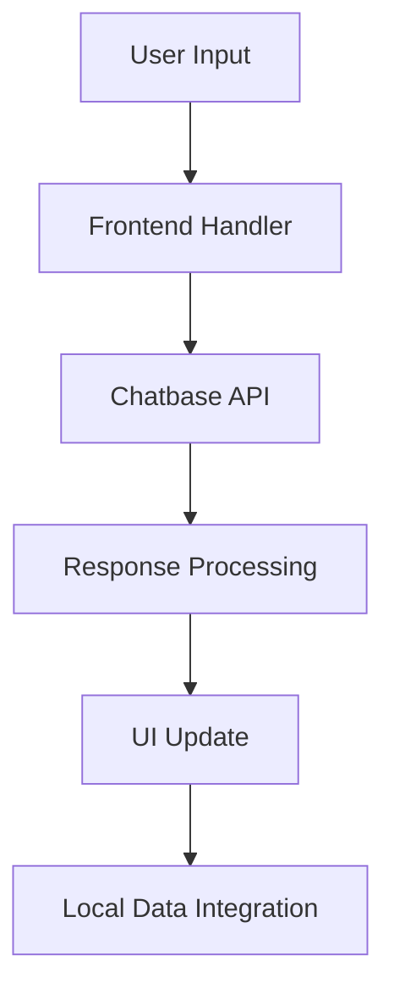

# Flower Chatbot Architecture

## System Overview

The Flower Chatbot is a web-based application that provides an interactive interface for users to learn about flowers and get gardening advice. The system integrates with Chatbase's AI-powered chatbot while maintaining a professional frontend architecture.

## System Components

### 1. Frontend Layer
- **HTML Structure**: Semantic markup with accessibility features
- **CSS Styling**: Responsive design with modern UI components
- **JavaScript Logic**: Event handling and UI interactions
- **Local Data**: JSON-based flower database for reference

### 2. Integration Layer
- **Chatbase API**: Handles all chatbot interactions
- **Session Management**: Tracks user conversations
- **Event System**: Manages UI updates and animations

## System Flow

## Key Features

1. **Real-time Chat Interface**
   - Seamless integration with Chatbase
   - Custom UI components
   - Loading states and animations

2. **Local Data Integration**
   - Flower database for reference
   - Quick access to common queries
   - Offline capability for basic information

3. **User Experience**
   - Responsive design
   - Accessibility features
   - Theme support (light/dark mode)

## Future Extensions

1. **Backend Integration**
   - User authentication
   - Conversation history
   - Custom flower database

2. **Advanced Features**
   - Image recognition for flowers
   - Seasonal recommendations
   - Garden planning tools

3. **Local LLM Integration**
   - Offline chat capabilities
   - Custom training on flower data
   - Enhanced response accuracy

## Technical Stack

- **Frontend**: HTML5, CSS3, JavaScript
- **Integration**: Chatbase API
- **Data**: JSON
- **Version Control**: Git

## Security Considerations

- API key management
- User data protection
- Input sanitization
- XSS prevention

## Performance Optimization

- Lazy loading of resources
- Caching strategies
- Responsive image handling
- Code splitting 